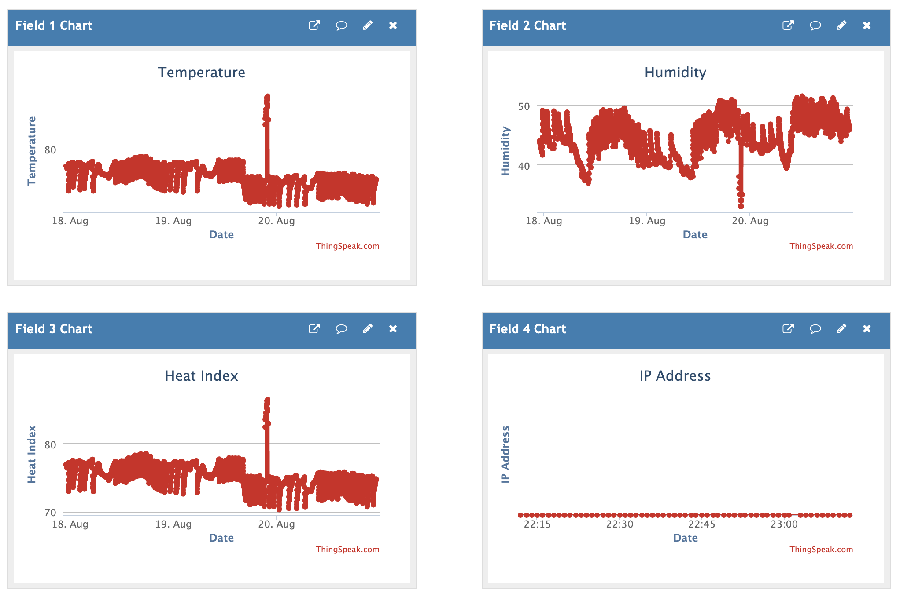

# Overview
This project is the first one that I tackled using platform io for Visual Code. I wanted to try out advance editing capabilities of visual code in conjuction with the plaform io extension, especially when compared to the very simple Arduino IDE. I have to say that platform io did not disappoint.

Also, this is my first attempt at using an IOT cloud service, in this case ThingSpeak which allows quite a few free devices and variables for free. A definite plus when compared to the Arduino Cloud.

My inspiration was to compare the fluctuations through out the day between sections of my place, namely the attic and some common areas. I want to see to what degree the attic temperature affected the temperature of the house and operation of my AC unit.

I included a celsius offset for displaying the current offset to better calibrate against another thermometer for consistent comparisons. The offset is stored in the flash to persist through power cycles.

# Requirements

To build this, you need visual code with platform io, an 8266 microcontroller, a 128x64 oled I2C display, a ThingSpeak account, and either a DHT11 or a DHT22 (the more accurate of the two).

I used the display to be able to read current readings as I moved the device from place to place. I did not want to have to rely on my phone or a computer all of the time.

I separated as much as possible into different project libraries and so you may be able to comment out some of the libraries in case you want to try this out without the display for instance and just with an 8266 and a temperature sensor.

If you look at the secrets.hpp file, you will find predefined constants which you have to replace with the right values in order to compile and make it work. I provided a primary and secondary wifi ssid and pass because I was rotating this device between two different places.

# Webserver
This code makes use of the 8266WebServer library. I used it to serve a simple Google Material Design site which show the current environment readings. The application is completely in html and javascript and is only downloaded once. Any subsequent data updates after every 30 seconds are made possible via the /data endpoint which serves a json file with all of the details for the client side to refresh.

# ThingSpeak Data points
1. Temperature
2. Humidity
3. Heat Index
4. IP Address // Used to be able to connect to the portal
5. SSID

# Sample output

# Known Issues

The mDNS library for 8266 has a bug which is preventing this implementation from letting other devices find it based on a name. There is an open bug on the 8266 Arduino github page already.